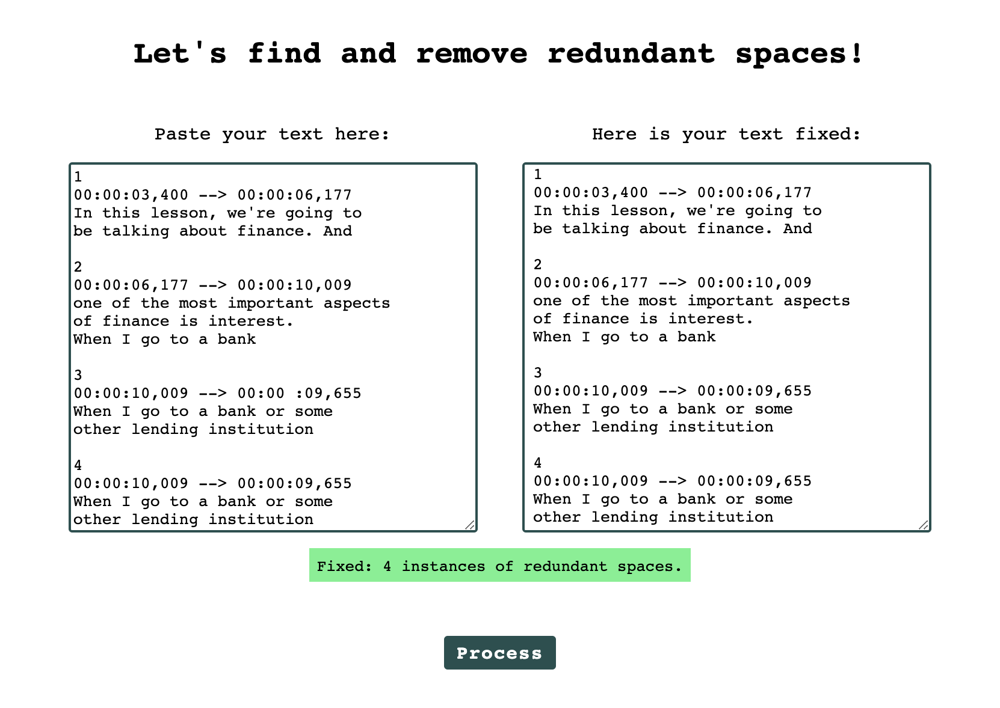
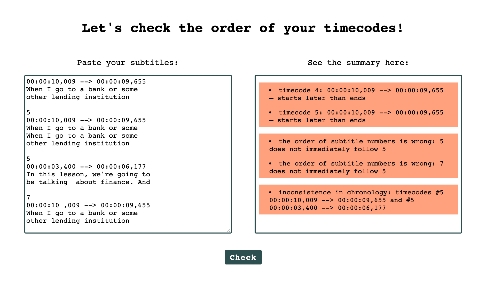
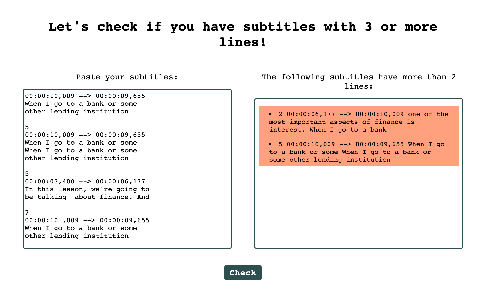
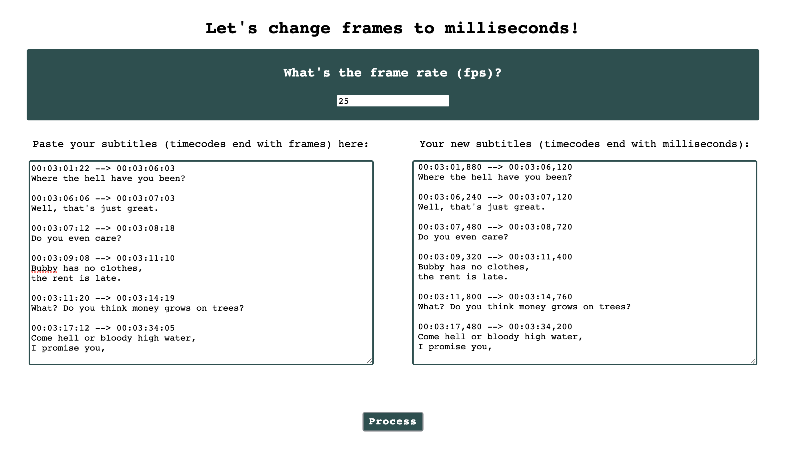

# Subtitlers' Tools

Regex tools for film translators and subtitlers for quick- and/or double-checking .srt file contents.

All tools are live here: [Subtitlers Tools](https://olhanotolga.github.io/subtitle-tools/)

Originally conceptualized as an accompanying toolset for the [Molodist Subtitlers](https://github.com/olhanotolga/molodist-subtitlers) project, a database for Ukrainian film subtitlers and translators.

## Space Remover

Removes repeating spaces between words, as well as spaces before periods, commas, colons, and semicolons.

## Timecode Checker

Checks the chronological order and numbering of your subtitles, as well as start and end timecodes.

## Multiline Checker

Checks if any of the subtitles contain over 2 lines. Outputs subtitles that need fixing.

## FPS to MS Converter

Converts frames into milliseconds and replaces them in the timecodes.

----

All tools are made with HTML, CSS, and JavaScript using Regular Expressions.
